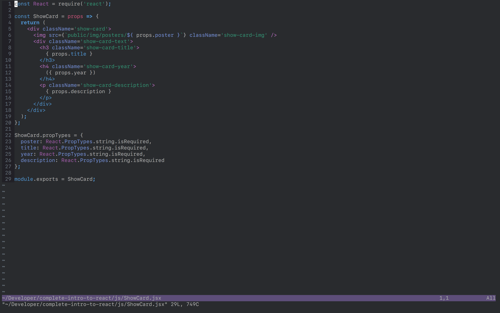
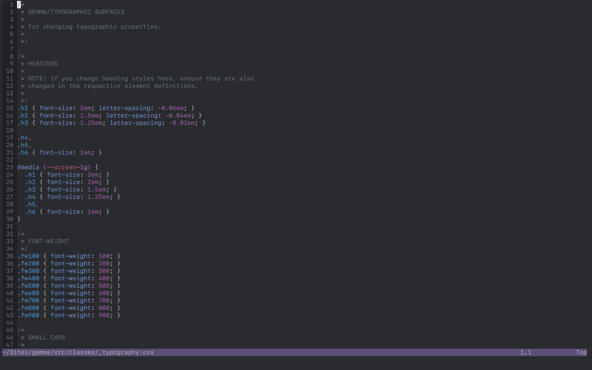

# base16-spacemacs-redux

A theme inspired by [nashamri/spacemacs-theme](https://github.com/nashamri/spacemacs-theme/), built with Base16, for Vim and iTerm. Work in progress.




## Usage

### Vim
Use your favourite plugin manager to track this repo (`colepeters/base16-spacemacs-redux`). Then specify the following in your `.vimrc` / `init.vim`:

```vimL
set background=dark
colorscheme base16-spacemacs-redux-dark
```

### iTerm2
Download the repo, and open the `.itermcolors` file from Finder. Ta-da!

## Development

- Clone the repo
- `npm install`
- Edit colours in the `base16-spacemacs-redux-dark.yaml` file
- `npm run build` to build the vim (`/colors`) colourscheme.

The iTerm theme is not built automatically, so colours need to be adjusted manually or through iTerm’s GUI.
